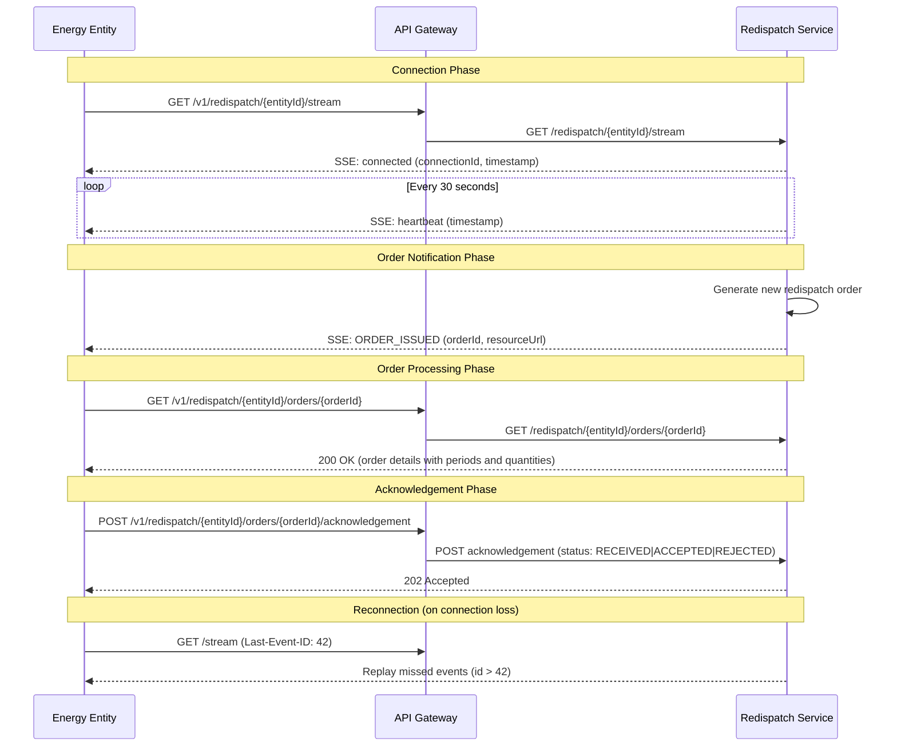

# TSO Redispatching Order Service

## 1. Business Case

Transmission System Operators (TSOs) are responsible for maintaining the stability and balance of electrical grids. When grid conditions require adjustments to power generation, TSOs issue **redispatching orders** to energy-producing entities, instructing them to increase or decrease their output within specified time periods.

This solution addresses the need for a **real-time, reliable communication channel** between TSOs and renewable energy generators. Key business requirements include:

- **Immediate notification** when new redispatching orders are issued
- **Reliable delivery** with support for reconnection and event replay
- **Formal acknowledgement** workflow to confirm order receipt and acceptance
- **Scalability** to handle thousands of concurrent entity connections

The system enables TSOs to efficiently manage grid stability while providing energy entities with timely, actionable instructions for adjusting their generation output.

---

## 2. Solution Architecture

The solution follows a **microservices architecture** with three primary components:

```
┌─────────────────────────────────────────────────────────────────┐
│                        Energy Entities                          │
│                    (SSE Clients / REST Clients)                 │
└─────────────────────────────────────────────────────────────────┘
                                │
                                ▼
┌─────────────────────────────────────────────────────────────────┐
│                      API Gateway (8080)                         │
│                    Spring Cloud Gateway                         │
│              Routes: /v1/redispatch/** → Service                │
└─────────────────────────────────────────────────────────────────┘
                                │
                                ▼
┌─────────────────────────────────────────────────────────────────┐
│                   Redispatch Service (8081)                     │
│  ┌─────────────────┐  ┌─────────────────┐  ┌────────────────┐  │
│  │  SSE Streaming  │  │    REST API     │  │  Order Store   │  │
│  │    Endpoint     │  │   (GET/POST)    │  │  (In-Memory)   │  │
│  └─────────────────┘  └─────────────────┘  └────────────────┘  │
└─────────────────────────────────────────────────────────────────┘
```

| Component | Technology | Responsibility |
|-----------|------------|----------------|
| **API Gateway** | Spring Cloud Gateway | Request routing, SSE streaming support, single entry point |
| **Redispatch Service** | Spring WebFlux | SSE event streaming, REST endpoints, order management |
| **Order Store** | ConcurrentHashMap | In-memory storage for orders and event replay |

**Communication Protocols:**
- **Server-Sent Events (SSE)** for real-time push notifications (unidirectional)
- **REST/JSON** for order retrieval and acknowledgement submission

---

## 3. Workflow

The following sequence diagram illustrates the complete interaction flow between an energy entity and the TSO system:



**Event Types:**
| Event | Purpose | Frequency |
|-------|---------|-----------|
| `connected` | Confirms SSE connection established | Once per connection |
| `heartbeat` | Keeps connection alive, detects failures | Every 30 seconds |
| `ORDER_ISSUED` | Notifies entity of new redispatching order | As orders are issued |

**Acknowledgement Statuses:**
- `RECEIVED` - Order received and understood
- `ACCEPTED` - Entity will comply with the order
- `REJECTED` - Entity cannot comply (with optional reason)

---

## 4. Load Tests Concept

The load testing suite validates system behavior under realistic and stress conditions using **Gatling**. Three complementary scenarios cover different aspects of system performance:

### Test Scenarios

| Scenario | Purpose | Key Metrics |
|----------|---------|-------------|
| **SSE Baseline** | Validate connection capacity | Max concurrent connections, connection success rate |
| **Full Workflow** | End-to-end performance under load | REST API response times, success rate |
| **Stress Test** | Find system breaking points | Throughput limits, error rates under overload |

### Measurement Strategy

The load tests distinguish between **event-driven waits** and **actual performance metrics**:

- **Not measured as performance:** SSE wait time for `ORDER_ISSUED` events (60-90s by design)
- **Measured as performance:**
  - SSE connection establishment time (target: < 5s p95)
  - GET order details response time (target: < 1s p95)
  - POST acknowledgement response time (target: < 500ms p95)
  - Overall success rate (target: ≥ 95%)

### Load Profile

Tests simulate realistic usage patterns with gradual ramp-up to avoid thundering herd effects:

```
Users
  ▲
  │         ┌─────────────────────────────┐
  │        /│        Steady State         │
  │       / │      (constant load)        │
  │      /  │                             │
  │     /   │                             │
  │    /    └─────────────────────────────┘
  └───/─────────────────────────────────────► Time
     Ramp-up        Hold Duration
```

This approach ensures the system is tested for both **connection scalability** (thousands of concurrent SSE streams) and **transactional throughput** (REST API operations per second).
